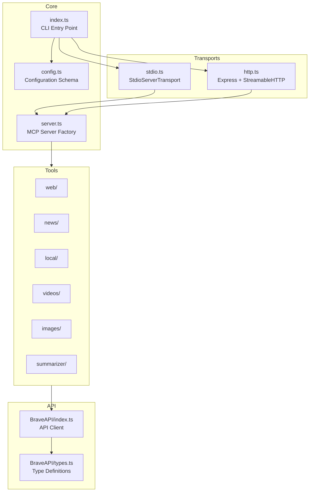

# Project Context

## Project Overview

**Brave Search MCP Server** is an official Model Context Protocol (MCP) server that integrates with the Brave Search API. It enables AI assistants—Claude, GitHub Copilot, and other MCP-compatible clients—to perform web, local, image, video, and news searches, plus AI-powered summarization.

**Publisher:** Brave Software, Inc.

**Tech Stack:**
- TypeScript with strict mode
- Node.js 22.x+
- ESM modules (`"type": "module"`)
- MCP SDK (`@modelcontextprotocol/sdk`)
- Express.js for HTTP transport
- Zod for schema validation
- Commander for CLI parsing

## Architecture



**Data Flow:**
1. Client request arrives via stdio (stdin) or HTTP (`/mcp`)
2. Transport delegates to MCP server, which routes to the appropriate tool
3. Tool validates parameters via Zod schema, invokes BraveAPI
4. `issueRequest()` constructs URL, transforms parameters, issues fetch
5. JSON response parsed and formatted by tool
6. MCP server serializes response back through transport

## Components

### Entry Point
- `src/index.ts` — CLI entrypoint. Parses configuration via Commander, dispatches to stdio or HTTP transport.

### Configuration
- `src/config.ts` — Zod schema for environment variables and CLI options. Exports `configSchema` for Smithery integration.
- `src/constants.ts` — Rate limit constants (`RATE_LIMIT_PER_SECOND`, `RATE_LIMIT_PER_MONTH`).

### Server
- `src/server.ts` — Factory function `createMcpServer()` that instantiates MCP server and registers permitted tools.

### Transports
- `src/protocols/stdio.ts` — Single-session stdio transport for process-based invocation.
- `src/protocols/http.ts` — Multi-session HTTP transport with UUID-based session tracking. Endpoints: `/mcp` (all methods), `/ping` (health check).

### API Client
- `src/BraveAPI/index.ts` — `issueRequest<T>()` generic function for typed API calls. Handles parameter transformation and auth headers.
- `src/BraveAPI/types.ts` — `EndpointTypeMap` discriminated union mapping endpoints to parameter/response types.

### Tools
Each tool directory follows a consistent structure:

| Tool | Directory | Purpose |
|------|-----------|---------|
| `brave_web_search` | `src/tools/web/` | General web search with optional enrichments |
| `brave_news_search` | `src/tools/news/` | Current news and breaking stories |
| `brave_local_search` | `src/tools/local/` | Location-aware business/POI search (Pro plan) |
| `brave_video_search` | `src/tools/videos/` | Video discovery with metadata |
| `brave_image_search` | `src/tools/images/` | Image search with structured output |
| `brave_summarizer` | `src/tools/summarizer/` | AI-generated summary from web search results |

**Tool Structure:**
- `index.ts` — Exports `name`, `description`, `annotations`, `params`, `execute`, `register`
- `params.ts` — Zod schema for input parameters
- `types.ts` — API response types

### Utilities
- `src/helpers.ts` — `registerSigIntHandler()` for graceful shutdown.
- `src/utils.ts` — `checkRateLimit()` (dormant), `stringify()` for JSON serialization.

## Development Commands

| Command | Purpose |
|---------|---------|
| `npm run build` | Compile TypeScript to `./dist/`, set executable permissions |
| `npm run watch` | TypeScript compiler in watch mode |
| `npm run format` | Format source with Prettier |
| `npm run format:check` | Validate formatting |
| `npm run inspector` | Launch MCP Inspector (stdio) |
| `npm run inspector:http` | Launch MCP Inspector (HTTP) |
| `npm run smithery:build` | Build for Smithery deployment |
| `npm run smithery:dev` | Run Smithery dev server |

## Code Conventions

### TypeScript
- Strict mode enabled (`"strict": true`)
- ESM modules with `NodeNext` resolution
- Target ES2022
- Use explicit return types on exported functions

### Tool Pattern
All tools follow this registration pattern:

```typescript
export const register = (mcpServer: McpServer) => {
  mcpServer.registerTool(
    name,
    {
      title: name,
      description,
      inputSchema: params.shape,
      annotations,
    },
    execute
  );
};
```

### Parameter Schemas
- Use Zod for validation
- Common constraints: `z.string().max(400)` for queries, `z.number().int().min(1).max(N)` for counts
- Country codes: `z.string().length(2)`
- SafeSearch: `z.enum(['off', 'moderate', 'strict'])`

### API Responses
- Format results for LLM consumption (extract salient fields, drop noise)
- Return `{ content: [{ type: 'text', text: stringify(data) }] }`
- Images tool uses structured output schema

### Error Handling
- BraveAPI throws on non-2xx responses with status, statusText, and body
- HTTP transport returns JSON-RPC error code `-32603` for unhandled exceptions

## Common Tasks

### Adding a New Tool

1. Create directory `src/tools/<toolname>/` with:
   - `index.ts` — Tool definition with `name`, `description`, `annotations`, `params`, `execute`, `register`
   - `params.ts` — Zod schema for parameters
   - `types.ts` — API response types

2. Export from `src/tools/index.ts`:
   ```typescript
   import NewTool from './newtool/index.js';
   export default { ..., NewTool };
   ```

3. Add endpoint to `src/BraveAPI/types.ts` in `EndpointTypeMap`

4. Add endpoint path to `Endpoints` object in `src/BraveAPI/index.ts`

### Adding a CLI Option

1. Define in `src/config.ts` within `configSchema`
2. Add Commander option in `src/index.ts`
3. Update `docker-compose.yml` if needed

### Running Locally

```bash
# Set API key
export BRAVE_API_KEY="your-key-here"

# Run with stdio transport (default)
npm run build && node dist/index.js

# Run with HTTP transport
npm run build && node dist/index.js --transport http --port 8080

# Debug with MCP Inspector
npm run inspector
```

### Docker Deployment

```bash
export BRAVE_API_KEY="your-key-here"
docker compose up --build
```

## Environment Variables

| Variable | Required | Default | Description |
|----------|----------|---------|-------------|
| `BRAVE_API_KEY` | Yes | — | Brave Search API key |
| `BRAVE_MCP_TRANSPORT` | No | `stdio` | Transport mode (`stdio` or `http`) |
| `BRAVE_MCP_PORT` | No | `8080` | HTTP server port |
| `BRAVE_MCP_HOST` | No | `0.0.0.0` | HTTP server bind address |
| `BRAVE_MCP_LOG_LEVEL` | No | `info` | Logging verbosity |
| `BRAVE_MCP_ENABLED_TOOLS` | No | — | Space-separated whitelist |
| `BRAVE_MCP_DISABLED_TOOLS` | No | — | Space-separated blacklist |

## Output Artifacts

| Artifact | Location | Notes |
|----------|----------|-------|
| Compiled JavaScript | `./dist/` | ESM modules targeting ES2022 |
| CLI entry point | `dist/index.js` | Executable binary |
| Module export | `dist/server.js` | Package main module |
